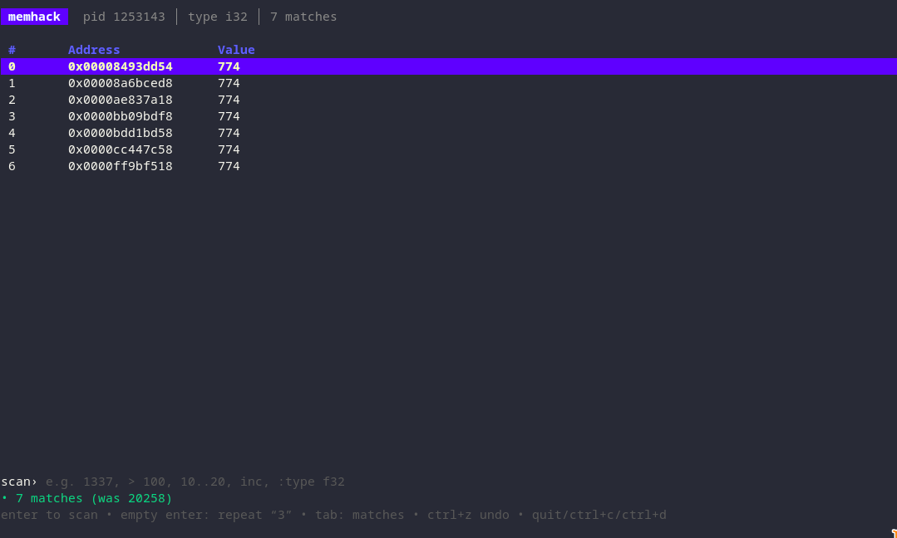
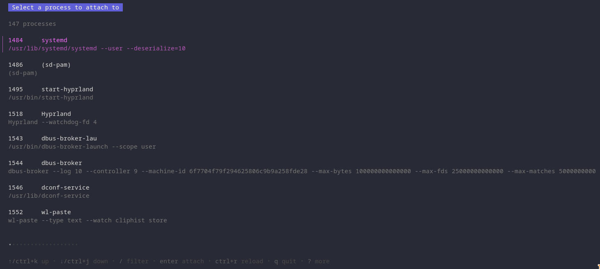

# memhack

A [scanmem](https://github.com/scanmem/scanmem)-style interactive memory
scanner for Linux, written in Go. Attach to a process, search its memory for a
value, narrow the matches down across successive scans as the value changes,
then write new values back.

It's the classic tool for inspecting and modifying a running program's state —
for debugging, reverse-engineering, or editing game values in a process you own.





## Building

```sh
go build -o memhack .
```

## Usage

memhack starts in a full-screen **TUI** (built with [Bubble Tea](https://github.com/charmbracelet/bubbletea)).
Attach to a running process by PID, or have memhack launch the program itself
(launching works even under a restrictive `ptrace_scope`, since a process can
always trace its own children):

```sh
./memhack -pid 12345
./memhack -exec ./mygame
```

Started with **no target**, memhack opens a **process picker** listing your
processes. Type <kbd>/</kbd> to search (by pid, name, or command line), scroll
with <kbd>ctrl+j</kbd>/<kbd>ctrl+k</kbd> (or arrows), <kbd>enter</kbd> to attach,
<kbd>ctrl+r</kbd> to reload. Reopen it any time with `:ps`.

You can also attach from inside the TUI with `:pid 12345` or `:run ./mygame`.

### The TUI

```
┌ memhack   pid 12345 │ type i32 │ 3 matches ──────────────────┐
│  #    Address           Value                                │
│  0    0x55c8e8e22030    1337       ← live-updating values     │
│  1    0x7ffd672ddfa0    1337                                 │
│  2    0x7ffd672ddfa8    1337                                 │
│                                                              │
│ scan› 1337                                                   │
│ • 3 matches                                                  │
└──────────────────────────────────────────────────────────────┘
```

- **Type a scan expression** in the `scan›` line and press **Enter** to scan
  (first scan finds all matches; later scans narrow them). The same expressions
  as the CLI work: `1337`, `> 100`, `10..20`, `changed`, `inc`, `dec 5`, …
- **Enter on an empty input repeats the last scan** — hold it down to keep
  narrowing (e.g. `inc`/`changed`) as a value keeps changing.
- **Esc cancels a scan in progress** (a full-memory first scan can take a
  while); the match set is left untouched.
- The **matches table** shows current values, refreshed live a few times a second.
- **Tab** switches focus between the input and the table. With the table focused,
  **↑/↓** select a row and **w** (or **Enter**) edits its value in place.
- **`:` commands**: `:pid N`, `:run prog args`, `:type f32`, `:set N value`,
  `:setall value`, `:reset`, `:undo`, `:q`.
- **Ctrl+Z** undo, **Ctrl+R** reset. **Quit** with `quit` (or `:q`), **Ctrl+C**, or **Ctrl+D**.
- While a scan or write is running, an animated spinner (`⣾ working…`) shows in
  the status bar; it appears only while work is in flight.

### The REPL

For scripting or headless use, `-repl` runs the original line-based interface:

```
$ ./memhack -repl -exec ./target
memhack> 1337               # first scan: find every location holding 1337
memhack[3]> dec             # keep only those that have since decreased
memhack[1]> list            # show remaining matches
[0] 0x55c8e8e22030 = 1200
memhack[1]> set 0 9999      # write 9999 into match #0
```

### REPL commands

| Command | Meaning |
| --- | --- |
| `pid <pid>` | Attach to a running process |
| `run <prog> [args]` | Launch a program as a child and attach |
| `type [t]` | Show/set the value type (`i8`,`i16`,`i32`,`i64`,`u8`–`u64`,`f32`,`f64`) |
| `regions` | List the target's scannable memory regions |
| `<value>` | Scan: keep locations equal to `<value>` (e.g. `1337`, `-5`) |
| `> < >= <= != <v>` | Scan: keep locations comparing that way to `<v>` |
| `<lo>..<hi>` | Scan: keep locations whose value is in the range `[lo, hi]` |
| `changed` / `unchanged` | Keep locations that did / didn't change since the last scan |
| `inc` / `dec` (`+` / `-`) | Keep locations that increased / decreased |
| `inc <n>` / `dec <n>` (`+ <n>` / `- <n>`) | Keep locations that changed by exactly `<n>` |
| `list [n]` | List current matches with their current values (first 50 by default) |
| `watch [interval]` | Live-update the matched values until Ctrl-C (e.g. `watch 250ms`) |
| `count` | Number of current matches |
| `set <i> <value>` | Write `<value>` to match `#i` |
| `setall <value>` | Write `<value>` to every match |
| `undo` | Revert the last scan, restoring the previous set of matches |
| `reset` | Discard matches and start over |
| `help`, `quit` | Help / exit |

A typical workflow: scan for a known value, let the program change it, scan with
`inc`/`dec`/`changed`/`<`/`>`/`lo..hi` to narrow the candidates, repeat until one
address remains, then `set` it. If a scan filters too aggressively, `undo` steps
back to the previous match set (up to 16 steps).

> **Operator note:** the change-by-amount forms use a *separated* operator —
> `- 5` / `dec 5` means "decreased by 5", whereas a glued `-5` is the negative
> literal −5.

## How it works

- **`/proc/<pid>/maps`** is parsed to find readable+writable regions worth scanning.
- **`/proc/<pid>/mem`** is read (with `pread`-style `ReadAt`) and written for the actual scanning and editing.
- **`ptrace`** (`PTRACE_SEIZE`) attaches to the target. Before each scan or write the
  process is briefly stopped (`PTRACE_INTERRUPT`) and then resumed (`PTRACE_CONT`),
  so every access sees a consistent snapshot without freezing the program between commands.
- The initial scan sweeps memory with 1-byte granularity (so unaligned values are
  found); later scans only re-check the surviving match addresses, which is why they're fast.
- **Threading.** `ptrace` binds the tracer to a single OS thread, so all
  process access runs on one dedicated, `LockOSThread`-pinned goroutine — the
  synchronous REPL goroutine in `-repl` mode, or a background **worker** in the
  TUI. The TUI's Bubble Tea `Cmd`s only pass requests to the worker over a
  channel, keeping the UI responsive while a large scan runs.

## Permissions

Reading and writing another process's memory requires permission to `ptrace` it:

- Same-user with a permissive `ptrace_scope`, **or**
- `CAP_SYS_PTRACE` (e.g. run via `sudo`), **or**
- The target is a child launched with `run`/`-exec`.

Check your setting with `cat /proc/sys/kernel/yama/ptrace_scope`. A value of `1`
(the common default) only lets you attach to your own descendants — use `run`, or
`sudo`, for anything else. Only use memhack on processes you own or are authorized to inspect.

## Layout

```
main.go                    entry point, flags, REPL, scan-expression parsing
tui.go                     Bubble Tea model: view, key handling, table + input
procpicker.go              startup process picker (searchable list) 
worker.go                  thread-locked worker owning the process/scanner;
                           controller exposing it to the TUI as tea.Cmds
internal/memory/proclist.go  /proc enumeration for the picker
internal/memory/maps.go    /proc/<pid>/maps parsing
internal/memory/mem.go     /proc/<pid>/mem read/write, attach lifecycle
internal/memory/ptrace.go  ptrace seize/interrupt/cont/detach
internal/memory/launch.go  launch a child process and attach
internal/scan/value.go     data types: parse, encode, decode, format
internal/scan/scanner.go   scan + narrow + write engine
```

## Status / ideas

This is an early scaffold. Natural next steps:

- Byte-array / string / regex scanning, and unknown-initial-value scans.
- Value "freezing" — a background loop that keeps rewriting an address.
- Alignment option (align scans to the type width for speed).
- Disassembly / pointer-map following.

## License

[MIT](LICENSE) © Phil Jackson
